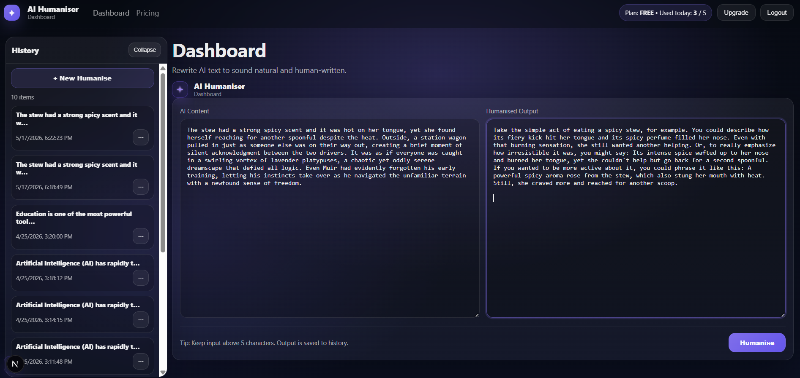
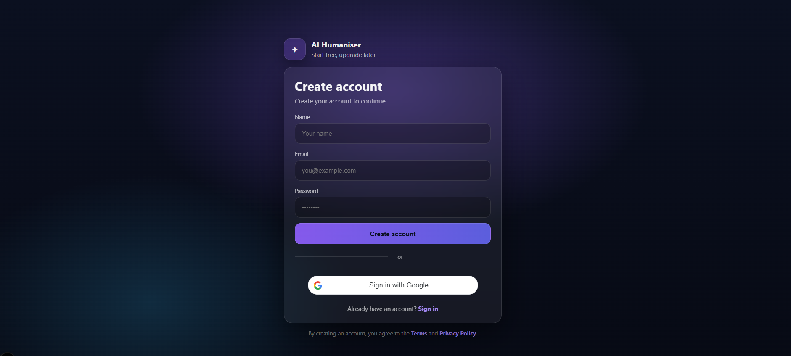

<div align="center">

# AI Humaniser

### AI-Powered NLP Platform for Human-Like Text Transformation & Readability Enhancement

<p align="center">
  Transform AI-generated text into more natural, engaging, and human-like writing using advanced Natural Language Processing and AI-powered rewriting pipelines.
</p>

<br/>


</div>

---

# Overview

AI Humaniser is an intelligent NLP-powered text optimization platform designed to transform AI-generated content into more natural, readable, and human-like writing.

The system leverages modern Natural Language Processing techniques, sentence restructuring pipelines, readability enhancement models, and semantic refinement algorithms to improve writing flow, tone, and overall text quality.

This project combines AI engineering, NLP workflows, and full-stack development into a modern interactive platform for AI-assisted content enhancement.

---

# Core Features

## AI Text Humanisation
- Human-like sentence restructuring
- AI-generated content refinement
- Natural writing enhancement
- Intelligent text transformation

## NLP Processing Pipeline
- Semantic rewriting
- Sentence flow optimization
- Context-aware paraphrasing
- Grammar refinement

## Readability Enhancement
- Improved sentence clarity
- Natural tone optimization
- Writing fluency enhancement
- Reduced robotic phrasing

## Interactive AI Dashboard
- Modern responsive frontend
- Real-time text processing
- Interactive user interface
- AI output visualization

---

# NLP Features

| Feature | Description |
|---|---|
| Sentence Restructuring | Reorganizes sentence flow for natural readability |
| AI Humanisation | Makes AI-generated text sound more human |
| Tone Optimization | Improves conversational tone and writing quality |
| Grammar Refinement | Corrects structural inconsistencies |
| Semantic Rewriting | Preserves meaning while improving readability |
| NLP Processing | Applies advanced linguistic transformations |

---

# Tech Stack

| Category | Technologies |
|---|---|
| AI / NLP | Transformers, NLTK, spaCy |
| Backend | Python, FastAPI |
| Frontend | Next.js, React, TypeScript |
| Styling | TailwindCSS |
| Tools | GitHub, VS Code |

---

# Project Architecture

```text
Frontend Dashboard
        ↓
FastAPI Backend
        ↓
NLP Processing Pipeline
        ↓
Sentence Restructuring
        ↓
Semantic Enhancement
        ↓
Humanised Output
```

# Screenshots

## Dashboard



---

## Login Page



---

# System Workflow

1. User enters AI-generated text  
2. Backend receives text input through FastAPI  
3. NLP pipeline processes sentence structure  
4. Semantic rewriting and readability optimization applied  
5. Humanised output generated  
6. Enhanced text displayed on frontend dashboard  

---

# Installation Guide

## Clone Repository

```bash
git clone https://github.com/AbiramiMuthiah/ai-humaniser.git

cd ai-humaniser

```
## Backend Setup:
Navigate to Backend

cd backend

Create Virtual Environment

python -m venv venv

Activate Environment

Windows

venv\Scripts\activate

Install Dependencies

pip install -r requirements.txt

Run Backend

uvicorn main:app --reload

Backend runs on:

http://127.0.0.1:8000

## Frontend Setup:
Open Another Terminal

cd frontend

Install Dependencies

npm install

Run Frontend

npm run dev

Frontend runs on:

http://localhost:3000

---

# Future Improvements

- Advanced transformer-based rewriting  
- Multi-language NLP support  
- AI readability scoring  
- Writing style customization  
- Real-time collaborative editing  
- AI content analytics dashboard  
- Cloud deployment pipeline  
- Fine-tuned LLM integration  

---

# Project Highlights

- AI-powered NLP rewriting platform  
- Human-like text transformation  
- Full-stack AI architecture  
- Interactive frontend dashboard  
- Readability optimization system  
- Semantic enhancement pipeline  
- Modern NLP engineering workflow  

---

# Author

## Abirami Muthiah

Applied AI Engineer | NLP & Data Science Developer  

### Specializations

- Natural Language Processing  
- Applied AI Systems  
- Machine Learning  
- Full-Stack AI Development  
- AI Analytics Platforms  

### GitHub

https://github.com/AbiramiMuthiah

---

# License

Licensed under the MIT License.
